# Microsoft Copilot Web

**Links**
[Google Slides Kikopilot](https://docs.google.com/presentation/d/1GscGEUzxtKfy4llIZSKBs2TU7nAziwbUe3W9X9hIoHU/edit?usp=sharing)

## What to remember

**About Copilot Web**
- **Chat with Copilot like any LLM**, but **<r>with data protection</r>** (thus, most technics available for other LLMs also work on Copilot).
- Web version, so it's not integrated in Microsoft 365 products.

Thus, the following mostly describes how to use an LLM that has vision capabilities, even though it will be using examples and limits specific to current Copilot version.

**About an LLM with Vision**
- Talk with it like a sort of **strange human assistant**, with a **lot of knowledge**, **relatively smart**, but **absolutely not proactive**, a bit **too confident** in it's answers, yet **really polite** and patient (don't talk much with it as a search engine like Google).
- Exploit vision, by sharing screenshots, images, that contain information (was not possible before Vision LLMs).
- Be counscious of it's greater ecological impact compared to a simple search on the web.

## Capabilities

**Copilot Web tools**
- Chat with text, voice, and image capabilities.
- Summarization of documents and web pages.
- Image creation in Designer (formerly Bing Image Creator).
- Web grounding.

**What it can do ([source](https://www.microsoft.com/en-us/microsoft-copilot)):**
- Compose essays, emails, and cover letters
- Create lists
- Describe art in detail
- Write code
- Summarize content
- Create poems and song lyrics
- Build your resume
- Search the internet

> [!warning]
> Copilot can do the same tasks than ChatGPT4, but **ensuring the protection** of your **private and business data** ([Official Microsoft comparison](https://support.microsoft.com/en-au/topic/chatgpt-vs-microsoft-copilot-what-s-the-difference-8fdec864-72b1-46e1-afcb-8c12280d712f)).


**Indeed, ChatGPT4 is used directly by Copilot** ([official source](https://support.microsoft.com/en-us/topic/copilot-in-bing-our-approach-to-responsible-ai-45b5eae8-7466-43e1-ae98-b48f8ff8fd44))
<details>
<summary><b>Original text</b></summary>
<i>"The new AI-enhanced Bing runs on a variety of advanced technologies from Microsoft and OpenAI, including GPT, a cutting-edge large language model (LLM), and DALL-E, a deep learning model to generate digital images from natural language descriptions, <b>both from OpenAI</b>"</i>
</details>


## How to use it?

### Access
- https://copilot.microsoft.com/
- Search in any browser > *"copilot"* > "Search Microsoft Copilot: Your everyday AI companion"

> [!CAUTION]
> Use Copilot with your business ID
> Don't use Copilot with your personal ID. Don't use ChatGPT or any other tool. **Only Copilot with your business ID** **<g>enables</g>** the **<r>data protection level required for processing client or private data</r>**.

### Sections of the web page

#### Chat area
3 conversation styles
- Creative
- Balanced
- Precise

<details>
<summary><b>Temperature</b></summary>
*"Temperature"* parameter in LLMs: *"temperature - A measure of how often the model outputs a less likely token. The higher the temperature, the more random (and usually creative) the output. This, however, is not the same as “truthfulness”. For most factual use cases such as data extraction, and truthful Q&A, the temperature of 0 is best."* ([source](https://help.openai.com/en/articles/6654000-best-practices-for-prompt-engineering-with-the-openai-api))
</details>

##### Example prompt `precise`

```
Write a short paragraph on Kiko milano
```
[Source](https://copilot.microsoft.com/sl/gMJz4MxjRk)

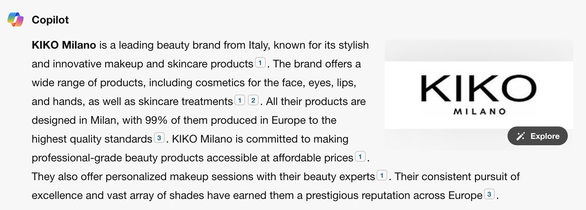


##### Same prompt `Creative`


Its answer relies **far less on verified information from a specific source** (and more on its own knowledge).


#### Copilot Notebook
*"It’s a new interface for crafting, improving, and revising your prompts without chat dialogue. Ideal when you need to iterate on a prompt to get the best result. It supports up to 18K characters.".* - Jordi Ribas, Microsoft's CVP of Search and AI.

**Pros**
- 18.000 characters vs 4.000 character limit in Copilot chat (veryfied manually).

**Use cases**
- Code debugging
- Correct / summarise longer texts


#### Context windows in general
- Depending on the model, it can be better at memorizing the whole discussion.
- "**primacy and recency effects**" known from human memory, states that most models have been proven to recall better the beggining and the end of a conversation ([source](https://the-decoder.com/large-language-models-and-the-lost-middle-phenomenon/), [source 2](https://arxiv.org/abs/2311.03839)). Including GPT-4 (used by Copilot).
- Ways in which contexts lenghts are currently extended might affect even more previous chat discussion (my own predictions). It would reduce the computational requirements and latency, at the cost of losing information that is too far at the beggining.
- **Rule of thumb**:
  - 1 token ~= ¾ words
  - 100 tokens ~= 75 words
  - 4000 tokens ~= 3000 words
  - 18000 tokens ~= 13.500 words


#### Voice
- Input a prompt without typing.
- Detects automatically the end of the sentence to trigger the answer.
- Answers using the voice.
- Any answer can be read-aloud even though the conversation has started and continued in text based only.
- The language preference can be set in the settings section. By default it adapts to the conversation and can switch during a conversation.

#### Settings
**Basic webapp settings**
- Language
- Suggestions while typing
- Color theme
- Region (for the web search)
- In privacy, possibility to remove the history.

### Basics

#### What is a prompt?
A prompt is:
- a text
- a request to the AI
- a description of the task that the AI should do for us
- a part of discussion with the AI

**Examples**
[Prompt 1: basic request](https://copilot.microsoft.com/sl/jfkdiefe1XE)

```
Please generate a bullet-point list of the most crowded cities on the planet.
```

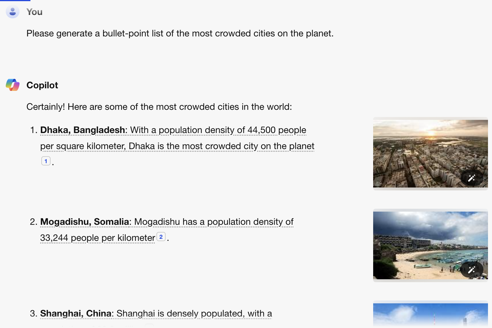


[Prompt 2: follow-up discussion](https://copilot.microsoft.com/sl/gmohrKmYsjA)

```
Please instead provide only their name and population in 2022.
No additional information of message around your answer.
```

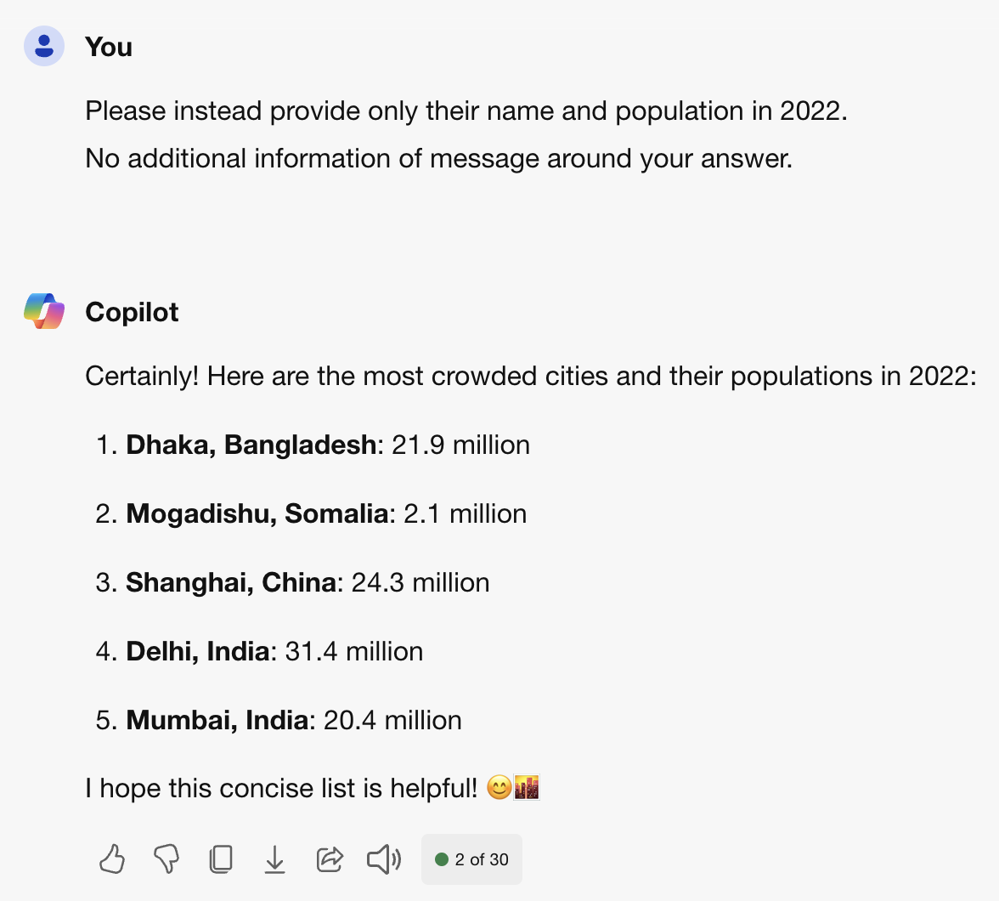


#### New topic (button)
Since the answer depend on the current context, it's important to manage the context consciously. If the previous information is not useful (it might then be harmful), create a new conversation.

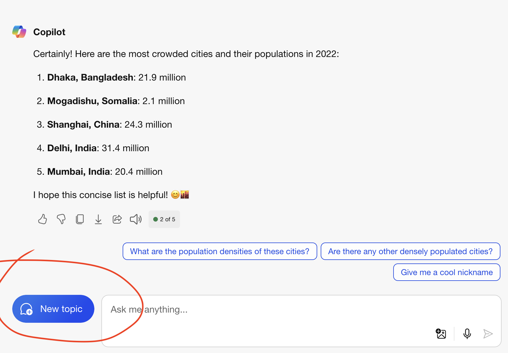

##### Prompt example

```
What is a PCA?
```

[Using a `previous` topic](https://copilot.microsoft.com/sl/bUaIyY9nfpI) (discussion / conversation): where the previous question provided a context about a technical user, eager to find maths in the previous answer. **Copilot** then also reply using a technical approach, adding mathematical details to the subsequent answers.

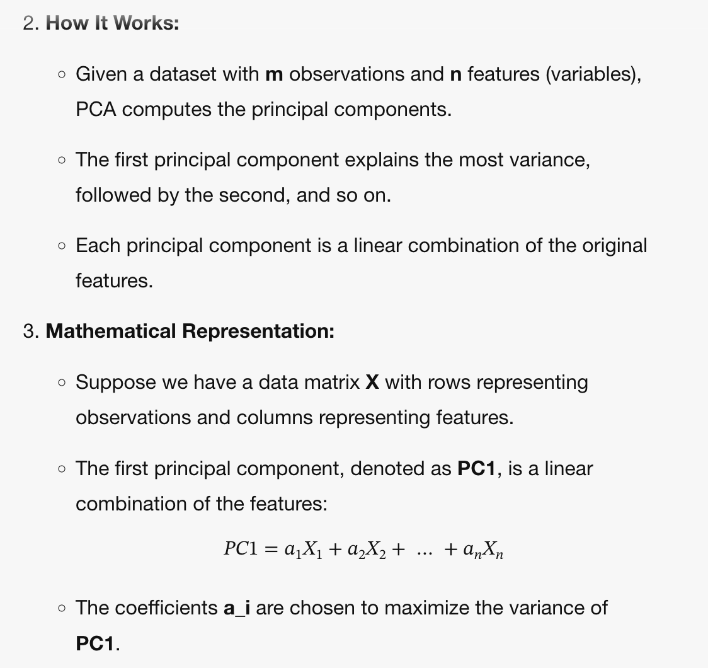

[Using a `new` topic](https://copilot.microsoft.com/sl/ckbyvFRXQCi): **Copilot** answers without much technical details and employs a ton that is adapted to a broader audience.

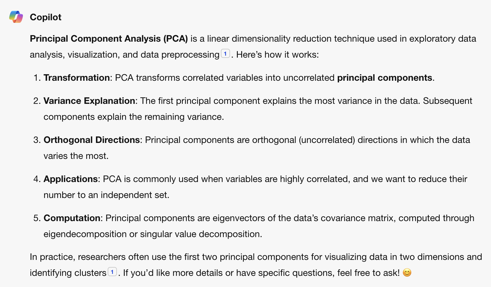


#### Copilot x Bing Search


Necessary for recent information, and any information that is not well knwon (in dozens of articles, books, etc.).

##### Prompt example 1
```
What are the best sellers products of Kiko milano?
```
[Source discussion](https://copilot.microsoft.com/sl/BJqTHRQWGa)

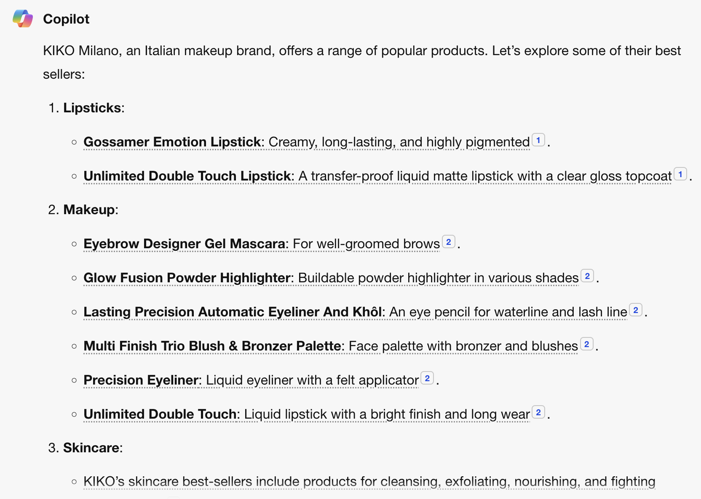

##### Prompt example 2
```
Write a blog post about sustainable practices in business for beauty industry.
```
[Source discussion](https://copilot.microsoft.com/sl/i5o6FFtFmF2)

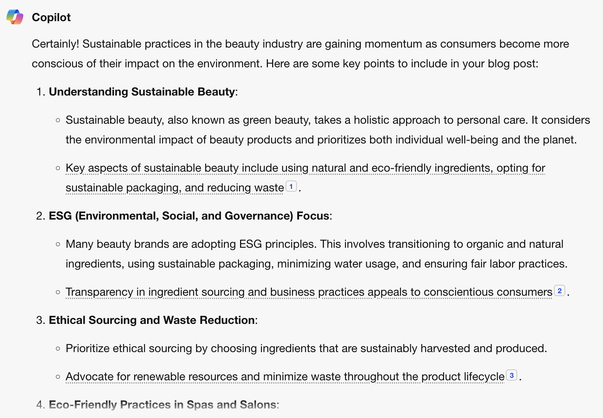

##### Prompt example 3
```
What was the result of France vs Spain?
```
[With search](https://copilot.microsoft.com/sl/0yQZaaL3cq)

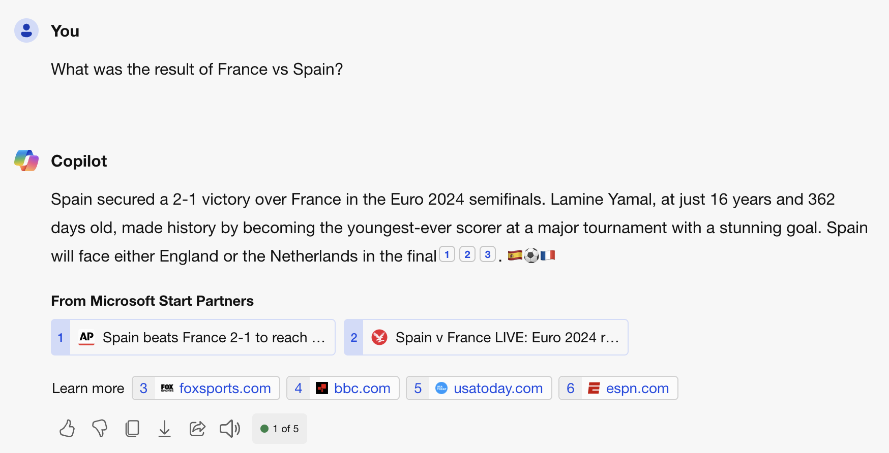


##### Prompt example 2
> [!tip] 
> Knowledge with or without sources?
>- Difference between LLM knowledge without search (**global internet**) vs knowledge through **few sources** (precise, with sources, but potentially more limited and more heavily biased).
>- Can be smarter without internet.
>- In these cases, ask the model to use only its knowledge to prevent its use of search (or disable Search plugin depending on your version).

<details>
<summary><b>More details</b></summary>
<i>"Bing has integrated Copilot into the Bing search experience [...] The sources Copilot uses to <b>form its answer are derived from the same ranking of third-party search results as the main web search results page</b>. These results are displayed clearly to the user, giving them the opportunity to dive deeper by visiting the third-party site."</i>
</details>

```
What are the main habbits that people struggle to implement in their lives?
```

Without Search ([attempt 1](https://copilot.microsoft.com/sl/cU6GIqeS6Oi), [attempt 2](https://copilot.microsoft.com/sl/cRjpS80cKnA))

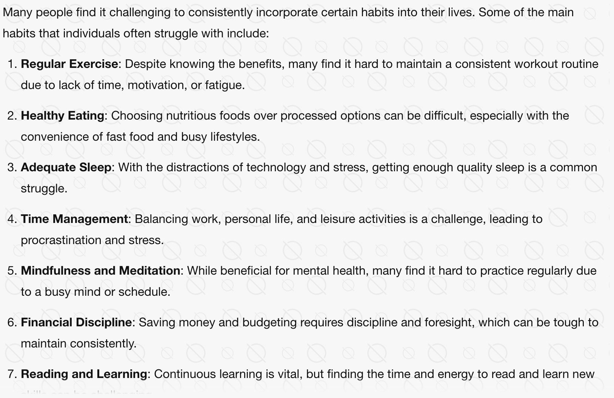

With Search enabled ([attempt 1](https://copilot.microsoft.com/sl/dV4J7R7Evy8), [attempt 2](https://copilot.microsoft.com/sl/iKcHcB3WeEC))

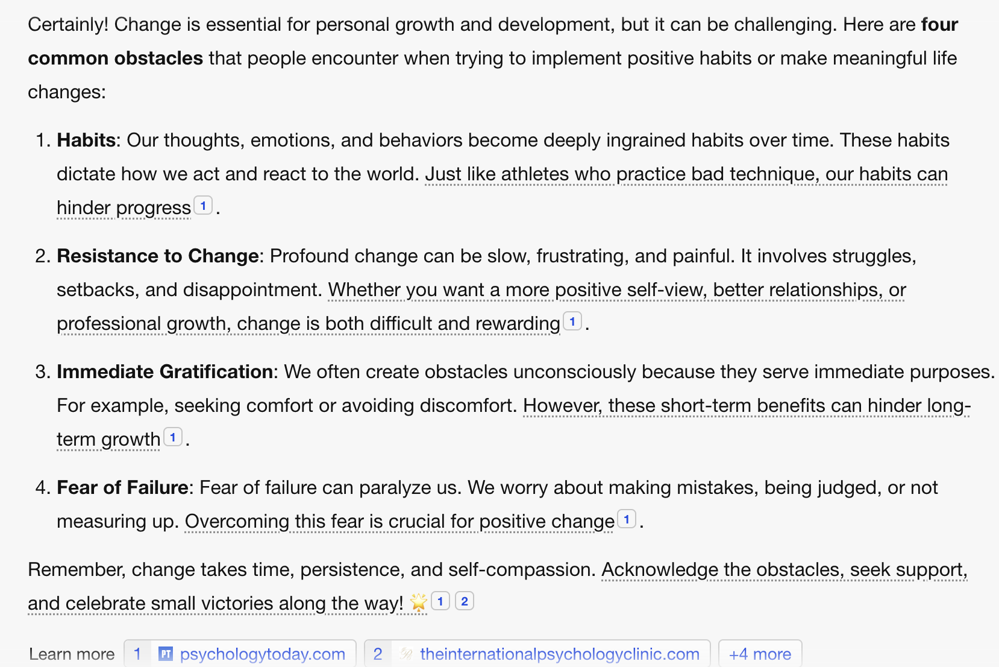

### How to prompt

#### One-shot prompt
> [!WARNING]
> The context is **very important**: more information = less room for chance in the answer from Copilot. It's like asking something to a new employee that know nothing about your company, your objectives, your ways.

From [Microsoft tips](https://support.microsoft.com/en-us/topic/cooking-up-a-great-prompt-getting-the-most-from-copilot-7b614306-d5aa-4b62-8509-e46674a29165?ocid=CopilotLab_SMC_Article_GetTips):
- **Goal**
- **Context**
- **Source**
- **Expectations** (response style)


#### Follow-up / disucssion
Reduces the space of possibilities. It is a simpler (rather than creating a huge single prompt) more human friendly way to both provide the context and details for the query to be understood properly by Copilot.

#### Being explicit, adding decorations
Any punctuation, tag, or any way to make the query easier to digest might help Copilot provide better answers.

#### Examples

##### From Microsoft

**Prompt 1**:
```
Write a blog post about sustainable practices in agriculture.
```

**Prompt 2**:
```
Craft a 1500-word blog post for a general audience interested in sustainability,
focusing on the significance and benefits of sustainable agricultural practices
like organic farming and agroforestry. Include real-world examples, innovative
technologies, and insights from reputable sources. Conclude with a reflection on
the importance of these practices and a call for collective efforts to embrace them.
```

##### Strategies and tactics

**Strategy**: Write clear instructions
- Tactic: Include details in your query to get more relevant answers
- Tactic: Ask the model to adopt a persona
- Tactic: Use delimiters to clearly indicate distinct parts of the input
- Tactic: Specify the steps required to complete a task
- Tactic: Provide Examples
- Tactic: Specify the desired length of the output
- Tactic: Instruct the model to answer with citations from a reference text


**Strategy**: Provide reference text
- Tactic: Instruct the model to answer using a reference text
- Tactic: Instruct the model to answer with citations from a reference text

**Strategy**: Split complex tasks into simpler subtasks
- Tactic: Use intent classification to identify the most relevant instructions for a user query
- Tactic: For dialogue applications that require very long conversations, summarize or filter previous dialogue
- Tactic: Summarize long documents piecewise and construct a full summary recursively

**Strategy**: Give models time to "think"
- Tactic: Instruct the model to work out its own solution before rushing to a conclusion
- Tactic: Use inner monologue or a sequence of queries to hide the model's reasoning process
- Tactic: Ask the model if it missed anything on previous passes


## Use cases

### Text only
- Format text
- Learning concepts (be careful though, good for STEM, bad for references and news).
- Ideas for rephrasing
- Summaries, information extraction
- Calculator and maths ([conv.](https://copilot.microsoft.com/sl/hWLY8ptyhwa))
- **Programming**, e.g. *"python code to split a mp3 into multiple mp3"* ([conv.](https://copilot.microsoft.com/sl/ig5aDgKjsMm))


#### Translation

```
Translate the following sentence in English please:
"Les outils d'intelligence artificielle sont un atout majeur pour la productivité d'une entreprise."
```

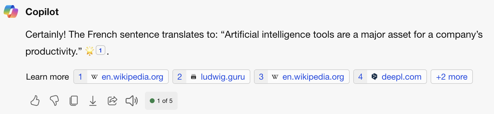


#### Search & recap

```
Trends in AI in 2024
```
[Source](https://copilot.microsoft.com/sl/gkJfRRIwQai)

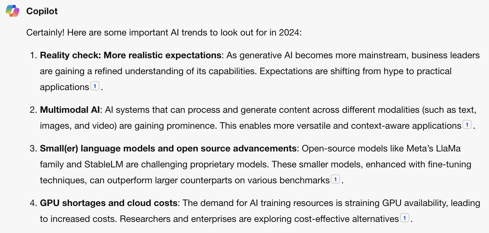


#### Mail

[Source](https://copilot.microsoft.com/sl/jVWSRbafyP6)

Prompt


Answer


### "Vision": Image to text
<!-- (could not be done without an LLM) -->
- Use screenshot as context
- Explain screenshot / image / photo
  - [conv. straightforward](https://copilot.microsoft.com/sl/dTXrxzvsU3w): impressive answer, good understanding of behaviours in pictures that contain subjects that are covered all over the internet.
      ```
      Can you describe this picture please?
      ```
      

      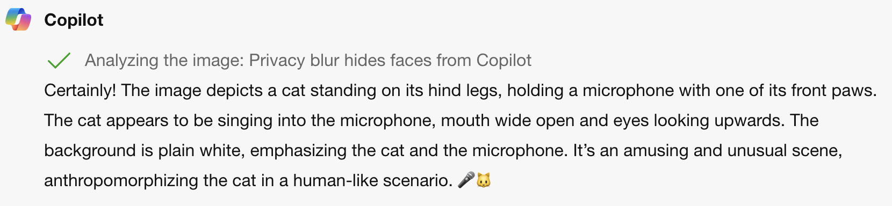

  - [conv. Easy graph](https://copilot.microsoft.com/sl/cSZL4rZrBZY): describes it correctly, good enough explanation of the drivers, misses the important blockchain (mining) driver.
  
  - [conv. Relatively easy graph and well known in Economics](https://copilot.microsoft.com/sl/hjkfgbxjvNY): describes it correctly but doesn't recognise it, doesn't know it's name.
  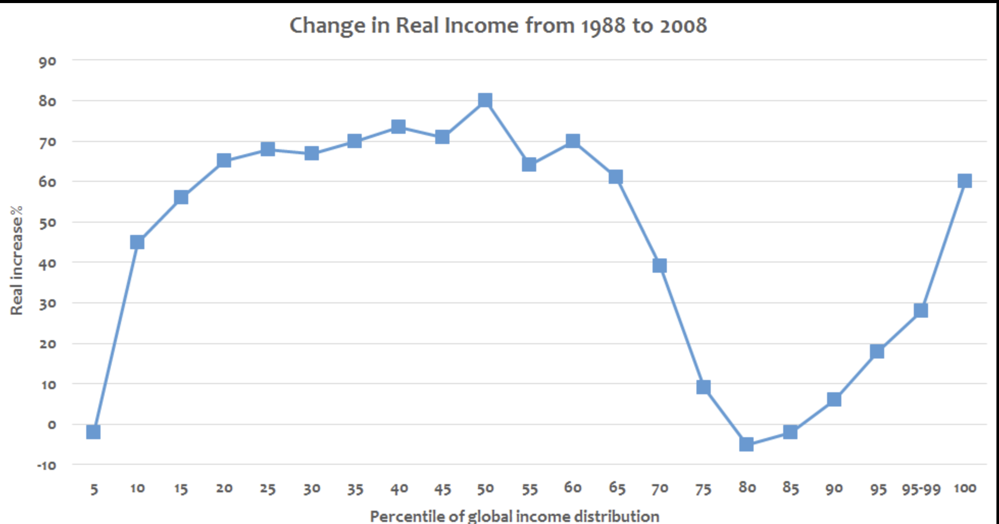
  - [conv. too complex graph](https://copilot.microsoft.com/sl/b9Aic7HDrVs): description misses the point, and is influenced by the most knwon overfitting issue.
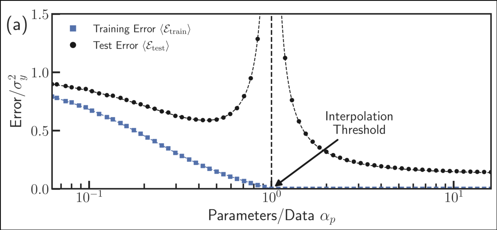

- Extract information from screenshot ([conv. complex info structure](https://copilot.microsoft.com/sl/keKYZ9uNnpc))


> [!CAUTION]
> Can you spot inconsistencies?


#### Debug

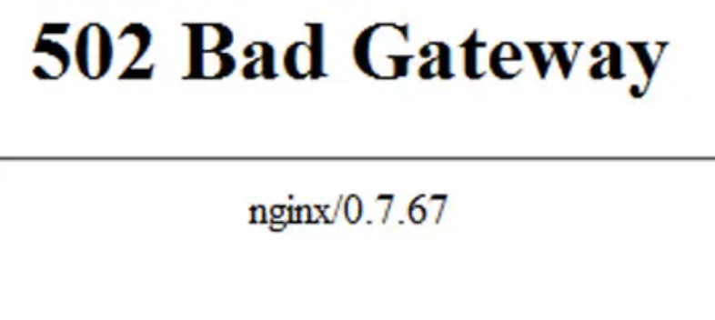

```
Help
```

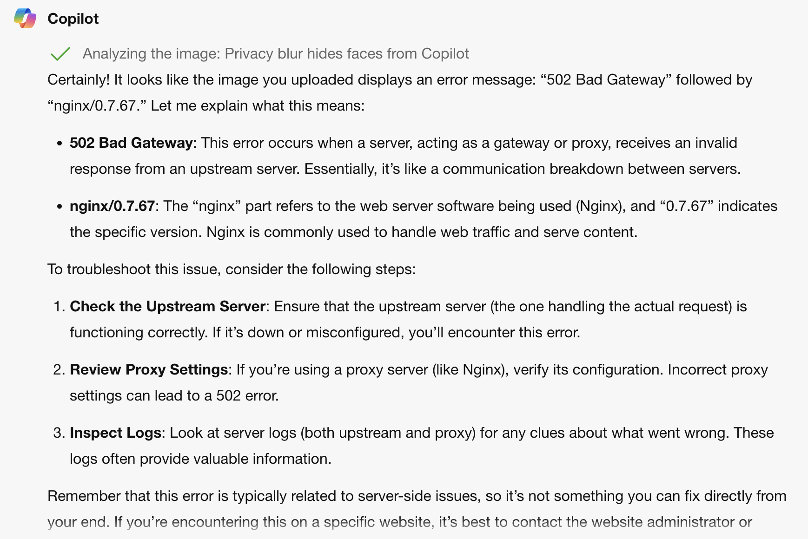

```
I don't understand
```

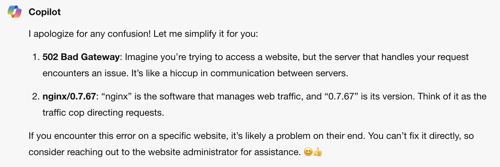


### Teaching

```
What is the Bayes theorem
```

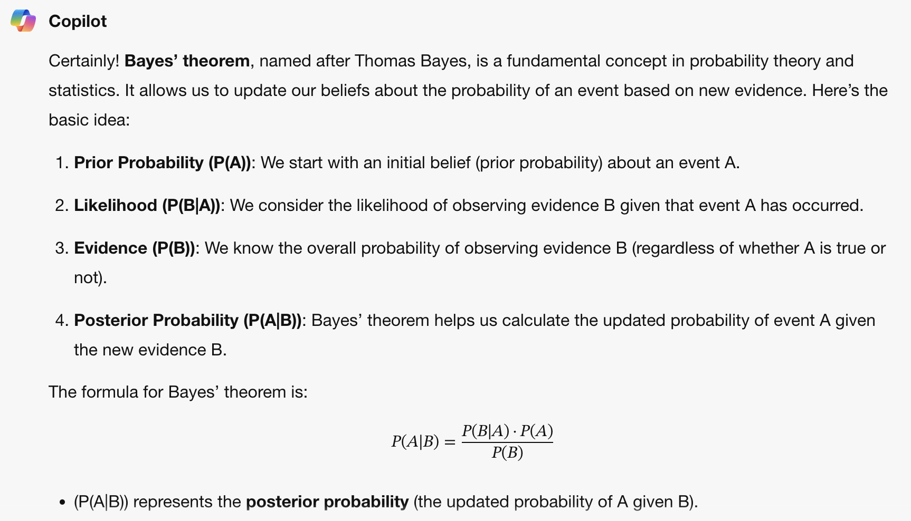


Asking for reformulation, explanation, examples, etc.
```
I don't have any background in statistics
```


Asking for verification
```
So one important aspect is that one should be aware of the average repartition of the population before making a guess?
```
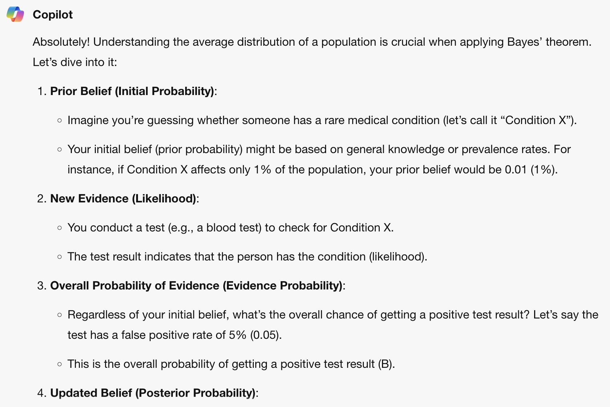


### Image generation
Using Dall-e 3 (see [Dall-e general blog](https://openai.com/index/dall-e/) , [Dall-e 3 blog](https://openai.com/index/dall-e-3/) and [Dall-e 2 paper](https://cdn.openai.com/papers/dall-e-2.pdf) for a better understanding of the technology).


#### Example 1: 
Almost impossible to obtain proper "text". Good with styles. Everything depends on its knowledge and understanding of the world physics.

```
Generate an image of a surfer in summer at biarritz surfing a pipeline
in the style of vintage travel poster
```

   

#### Example 2: Lipstick

Good understanding, pretty good rendering until... it got lost in the creativity (or bias?).

```
Generate a lipstick in a pure style like in a photo lightbox, extremely realistic
```


## Limitations

- Knowledge cut-off date: `October 2023`
- Bias (all the biases already present on internet: ethnicity, gender, etc.).

### Security

> [!CAUTION]
> Use Copilot with your business ID
> Dont use Copilot with your personal ID. Don't use ChatGPT or any other tool. **Only Copilot with your business ID** **<g>enables</g>** the **<r>data protection level required for processing client or private data</r>**.

- Review response (especially for queries you have never done several times yet)
- Fact check

### Technical points
- **Not open source**: weights and code not released publicly
- **<r>Randomness</r>** in the answers: statistical machines (lack of exact reproducibility)
- **<r>Potentially biased and incorrect</r>**: *"LLMs can occasionally generate content that is biased, offensive, harmful, or incorrect. Therefore, it is imperative to consistently review and validate the responses for accuracy and appropriateness."* ([source](https://support.microsoft.com/en-us/topic/get-better-results-with-copilot-prompting-77251d6c-e162-479d-b398-9e46cf73da55?ocid=CopilotLab_SMC_Article_BetterResults))


## Learn more

### General
- [Official courses: Copilot Lab](https://copilot.cloud.microsoft/en-US/prompts?ocid=copilot_akams_copilotlab)
- [FAQ](https://support.microsoft.com/en-au/topic/frequently-asked-questions-ai-microsoft-copilot-and-microsoft-designer-987b275d-f6f2-4d5d-94c5-e927cffae705)
- [Responsible AI](https://support.microsoft.com/en-us/topic/copilot-in-bing-our-approach-to-responsible-ai-45b5eae8-7466-43e1-ae98-b48f8ff8fd44)
- [Advanced methods for improving LLMs capabilities](https://lilianweng.github.io/posts/2023-03-15-prompt-engineering/)

### More on prompting!
- [In Engage](https://support.microsoft.com/en-us/topic/join-a-community-in-viva-engage-1ee29da1-5250-4c1e-b773-e7a78cfaf5d4)
- [Prompt Engineering guide](https://platform.openai.com/docs/guides/prompt-engineering)
- [Prompt Engineering best practices](https://help.openai.com/en/articles/6654000-best-practices-for-prompt-engineering-with-the-openai-api)
- [Demonstration prompt efficiency](https://cookbook.openai.com/articles/techniques_to_improve_reliability)
- [More extensive guide](https://www.promptingguide.ai/)

